# 2) XML Overview

## XML Types

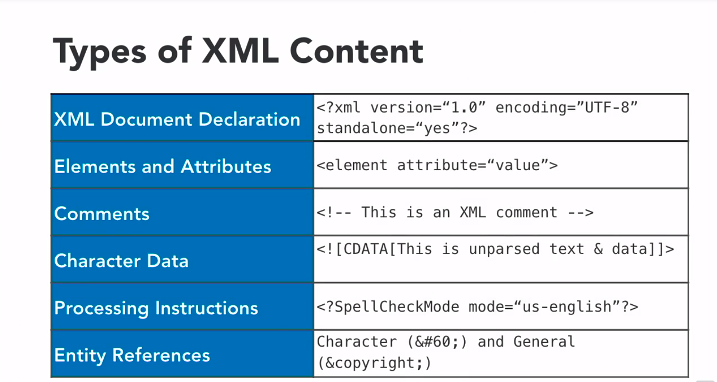

## XML Namespaces

We can define custom XML namespace, which needs to be unique name and with customized structure.

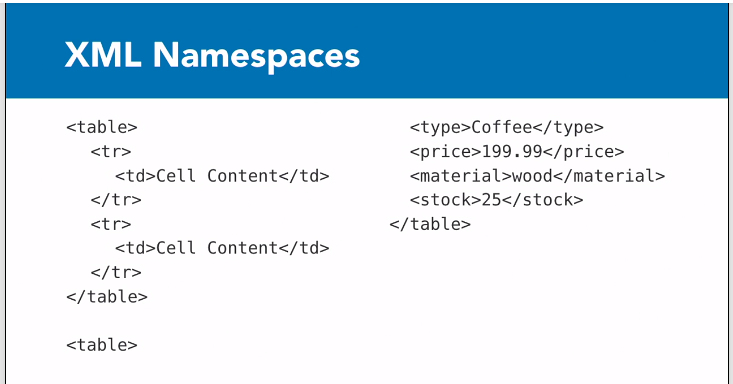
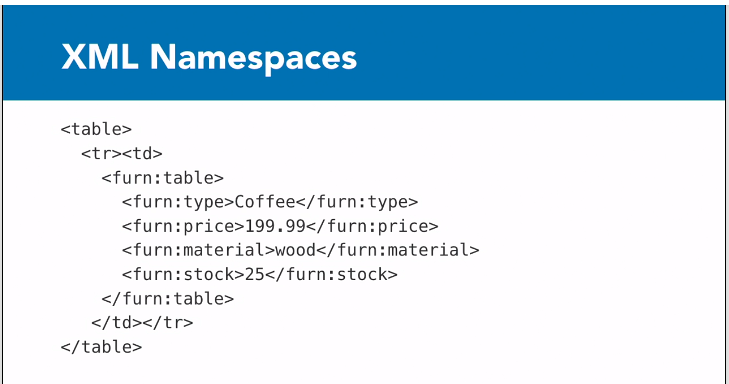

---

# 3) Working with XML

## Associat css style with XML

- We can associate css style for the XML elements like below.

  `<?xml-stylesheet type="text/css" href="businesscard.css" ?>`

- Nodes can be applied with custom css styling using the XML tag name directly like below.

  `Name {`
  ` color: blueviolet;`
  `}`

## Advanced Styling with CSS

- we can use custom attribute type and associate it with css to display custom styling.

  `<phone type="mobile" primary="super-important">(415) 555-4567</phone>`

  can be associated with css styling of

  `phone[primary]::after {`
  ` content: " (" attr(primary) ")";`
  `}`

  this will result to displayed in

  **(65)123 - 456 (super important)**

---

# 4) Manipulating XML with DOM

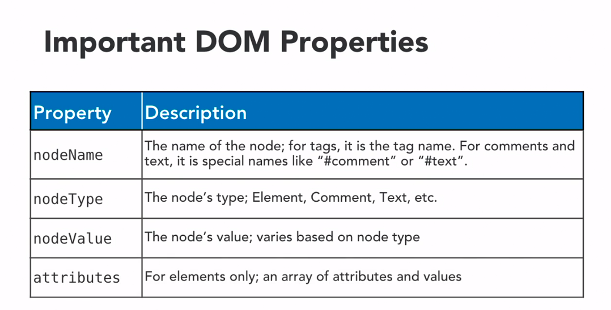
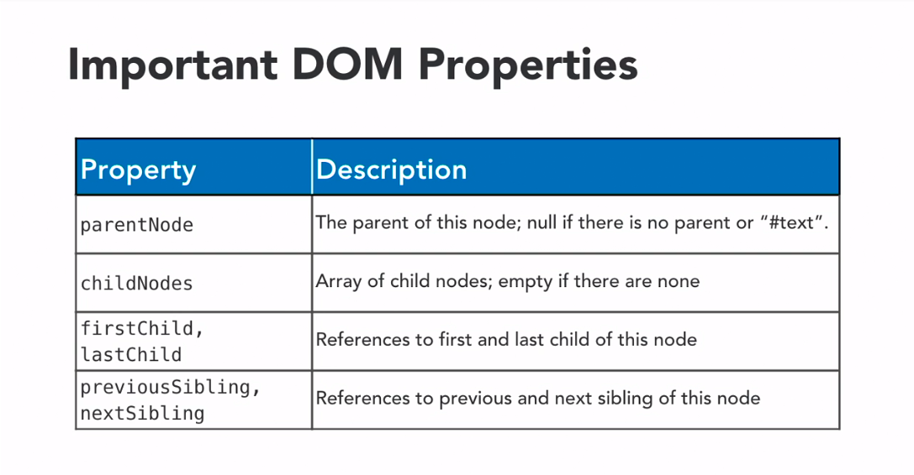
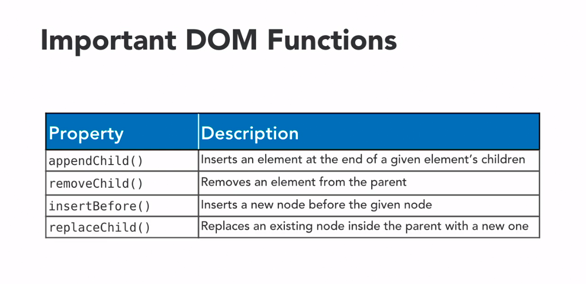
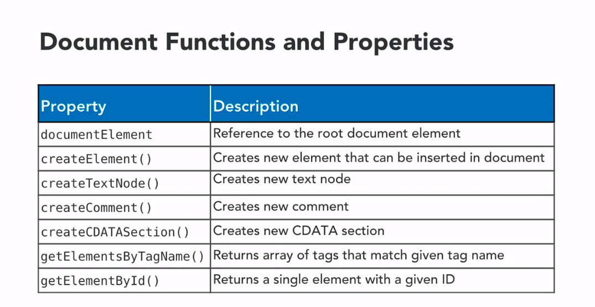

---

# 5) XML and XPath

## XPath important concepts

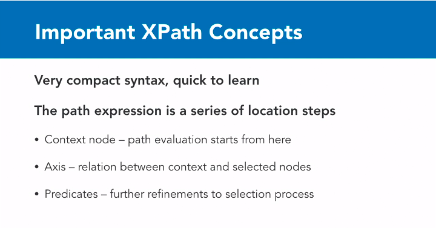

## Using XPath for selecting information

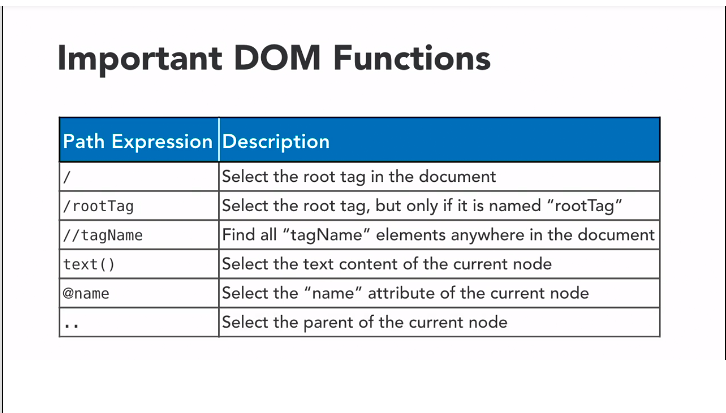

## businesscard.xml

### to select name

`/BusinessCard/Name`

### text of name, using text() function

`/BusinessCard/Name/text()`

### to select all phones

`/BusinessCard/phone`

### to select specific phone number 1, using predicate

Take note that in xpath, referencing list index **start from 1**, not like 0 from other langagues

`/Businesscard/phone[1]`

### last phone number, using last() function

`/BusinessCard/phone[last()]`

### check specific words in text using contains() function

`/BusinessCard/Name[contains(text(), 'Richard')]`

### get all phone numbers with the attributes "type"

`/BusinessCard/phone[@type]`
(or)
`//phone[@type]`

### get all phone numbers with the attributes "type" of "work"

`/BusinessCard/phone[@type='work']`
(or)
`//phone[@type='work']`

## items.xml

### we want to select photo of Coffee type

`/items/item[type='Coffee']/photo`

---

# 6) XML and XSLT

## What is XSLT?

- eXtensible Stylesheet Language Trnasofrmations
- Different than CSS - applies templates to XML data
- Written using XML syntax itself
- can transorm XML into almost anything
- can perform operations directly on the data.
- more at https://wwww.w3.org/TR/xslt

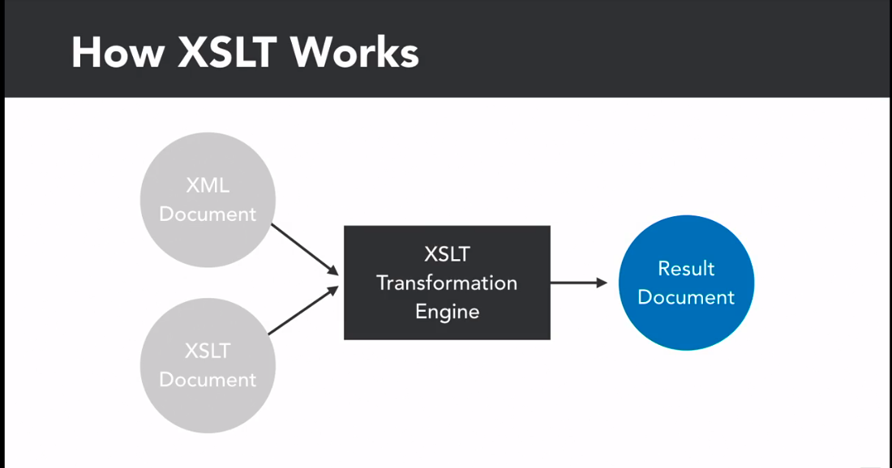
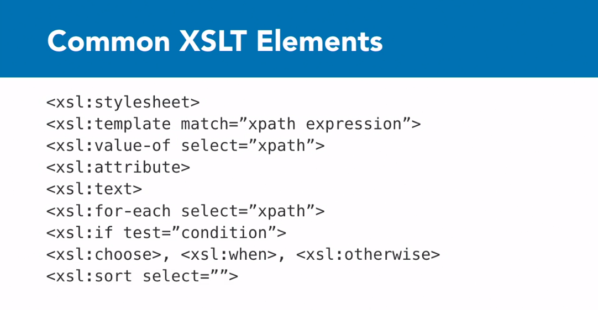
In below example, we are getting source element(SimpleTag) and replace with whatever we define in this XSLT template (in this case some html).
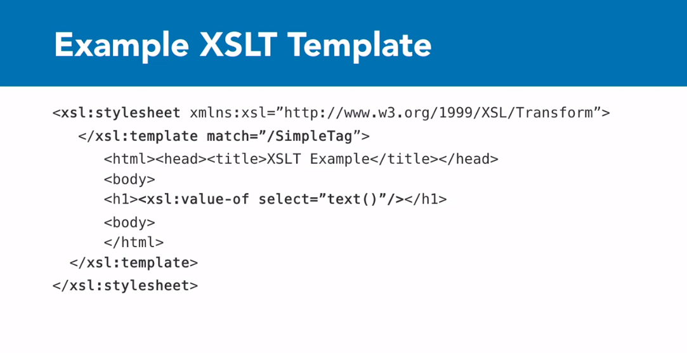

---
